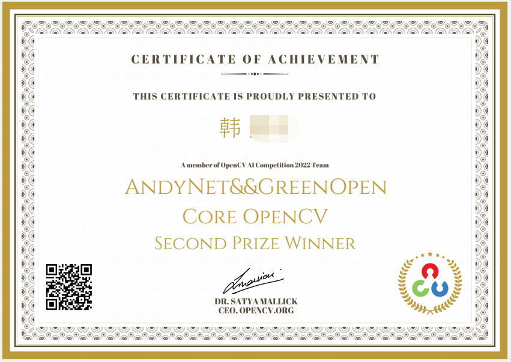
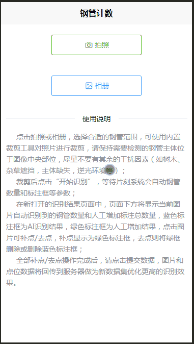
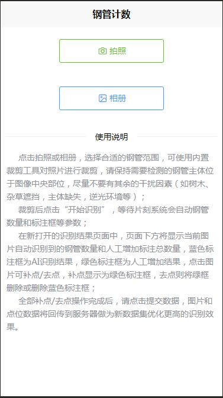
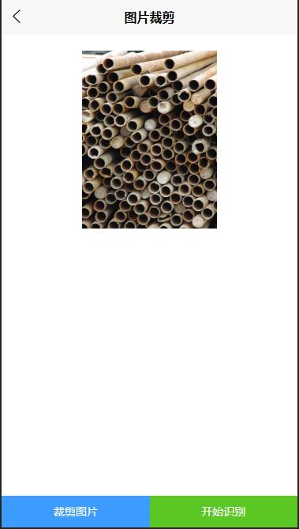
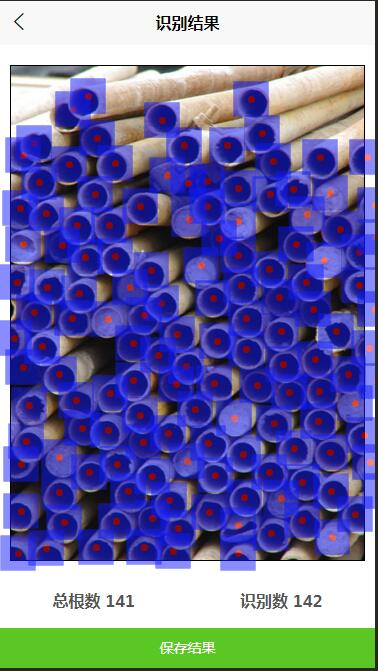
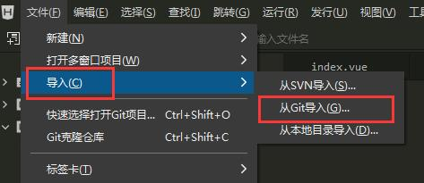
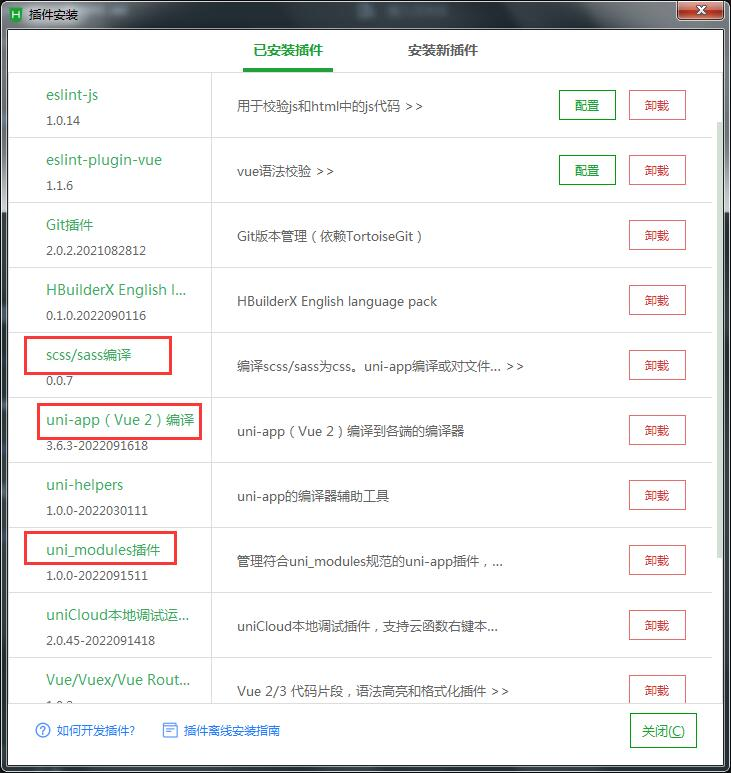
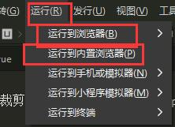
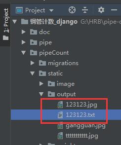

# 钢管计数-uniapp

[README](README.md) | [English Doc](README_En.md)

 


### 恭喜该项目荣获国际性OpenCV 2022竞赛团队奖第二名！！！
### 项目组成员：禾老师+作者本人(AndyNet&&GreenOpen)

#### 介绍
钢管计数UNIAPP前端版本，使用uniapp框架进行开发。

目前仅针对H5页面进行开发调试，其他终端平台未进行调试，欢迎各位修改补充。

该项目需与作者提供的后端项目搭配使用！

感谢禾路老师全程专业指导！

[专注图像处理-jsxyhelu](https://www.cnblogs.com/jsxyhelu)

后端采用Django框架进行开发，主要对接API：

```
http://www.xxx.com/finds   --->   钢管识别接口
http://www.xxx.com/save    --->   保存结果接口

```

后端项目：[钢管计数-django](https://gitee.com/atvip/pipe_count_django)

**PS: 该项目仅可做为学习研究所用，未经作者许可，不得用于商业用途！**

#### 截图展示



1、 项目首页



2、 图片裁剪页



3、 识别结果页



#### 软件架构

**插件均使用uniapp官方插件，感谢插件方的支持！**

UI组件库       ---> uview-ui 2.0.33

[uView2.0](https://ext.dcloud.net.cn/plugin?id=1593)

图片裁剪插件    ---> ksp-cropper

[ksp-cropper](https://ext.dcloud.net.cn/plugin?id=6878)


#### 安装教程

1、 uniapp项目搭建方法请参考uniapp官网介绍，此处不做讲解。

[uniapp](https://uniapp.dcloud.net.cn/quickstart-hx.html)

2、 推荐使用uniapp官网指定开发工具 HbuilderX 导入该项目：



3、 在HbuilderX工具中安装相应插件：




#### 使用说明

**本地运行：**

1、 运行到浏览器或内置浏览器查看项目运行结果：



2、 在浏览器中输入链接查看项目：

请注意本地8080端口占用情况！

```
http://127.0.0.1:8080
```

3、 项目保存结果页面提交结果后，将由后端程序自动生成YOLOV5格式数据集文件，文件名与用户上传图片文件名一致！

```
数据集路径：  后端项目根目录/pipeCount/static/output/
```



#### 参与贡献

1.  Fork 本仓库
2.  新建 Feat_xxx 分支
3.  提交代码
4.  新建 Pull Request

