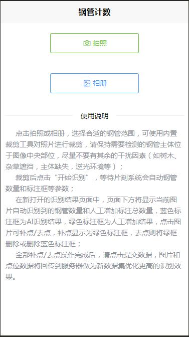
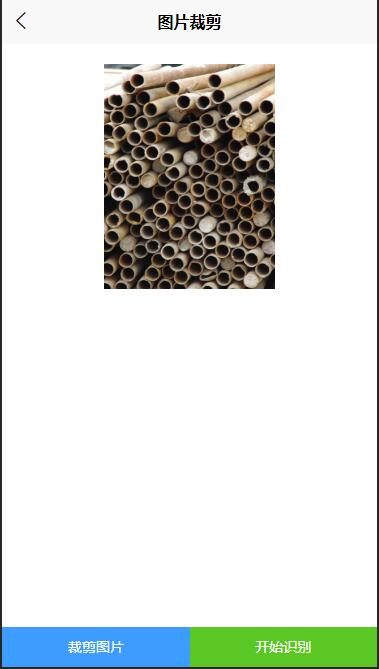
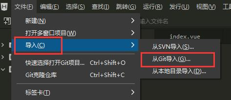
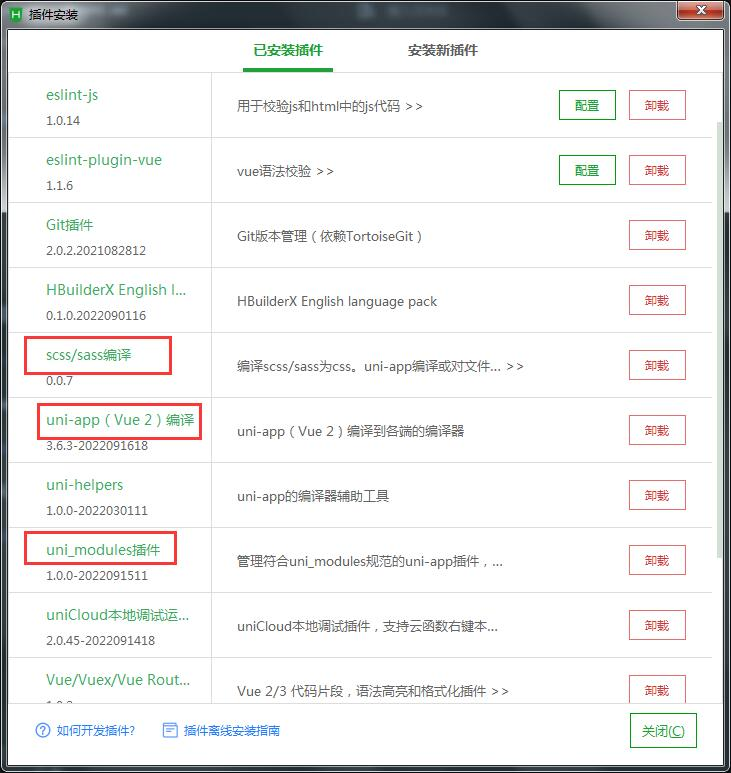

# pipe count -uniapp

 


### Congratulations to this project for winning the second place in the International OpenCV 2022 Competition Team Award! ! !
### Project team members: MrHe + MrHan (AndyNet&&GreenOpen)

#### introduce
Steel pipe counting UNIAPP front-end version, using the uniapp framework for development.

At present, only the H5 page is developed and debugged, and other terminal platforms have not been debugged. You are welcome to modify and supplement.

This project needs to be used in conjunction with the backend project provided by the author!

Thanks to Mr. Helu for his professional guidance throughout!

[Focus on image processing-jsxyhelu](https://www.cnblogs.com/jsxyhelu)

The backend is developed using the Django framework, which mainly connects to the API:

```
http://www.xxx.com/finds ---> steel pipe identification interface
http://www.xxx.com/save ---> save the result interface

```

Backend project: [pipe count-django](https://github.com/mrhanCH/pipe_count_django)

**PS: This project can only be used for study and research, without the author's permission, it cannot be used for commercial purposes! **

#### Screenshot display


1. Project home page



2. Picture cropping page



3. Recognition result page


#### Software Architecture

**All plug-ins use uniapp official plug-ins, thanks for the support of the plug-ins! **

UI component library ---> uview-ui 2.0.33

[uView2.0](https://ext.dcloud.net.cn/plugin?id=1593)

Image cropping plugin ---> ksp-cropper

[ksp-cropper](https://ext.dcloud.net.cn/plugin?id=6878)


#### Installation Tutorial

1. For the construction method of uniapp project, please refer to the introduction on the official website of uniapp, which will not be explained here.

[uniapp](https://uniapp.dcloud.net.cn/quickstart-hx.html)

2. It is recommended to use the designated development tool HbuilderX on the uniapp official website to import the project:



3. Install the corresponding plug-in in the HbuilderX tool:




#### Instructions for use

**Run locally:**

1. Run to the browser or the built-in browser to view the project running results:


2. Enter the link in the browser to view the project:

Please pay attention to the local 8080 port occupancy!

```
http://127.0.0.1:8080
```

3. After submitting the result on the project saving result page, the back-end program will automatically generate a YOLOV5 format dataset file, and the file name is consistent with the file name of the image uploaded by the user!

```
Dataset path: Backend project root directory /pipeCount/static/output/
```


#### Contribute

1. Fork this warehouse
2. Create a new Feat_xxx branch
3. Submit the code
4. Create a new Pull Request
